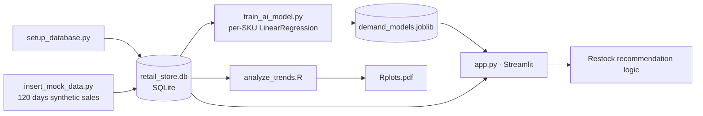

# Smart Retail Restocking Dashboard

An AI-powered retail inventory system that forecasts weekly product demand
per SKU and turns that forecast into automated restocking recommendations,
built with Python, scikit-learn, SQLite, Streamlit, and R.

## The problem

Manual restocking decisions either over-order (tying up cash and shelf
space) or under-order (stockouts, lost sales). This dashboard predicts
next week's demand for each product individually and flags exactly when
and how much to reorder, based on current stock, a safety buffer, and the
forecast.

## The model

Demand forecasting only earns trust if it's evaluated honestly, so this
project is built around that:

- **One model per product**, not one model pooling all products together -
  milk, bread, and bananas have different demand patterns and each gets
  its own regression.
- **Weekly seasonality feature** (day_of_week) alongside the day-number
  trend, so weekend demand spikes are captured instead of averaged away.
- **Chronological train/test split** (train on the first 80% of days, test
  on the most recent 20%) - the same direction real forecasting is used in.
- **Evaluated against a naive baseline** ("predict tomorrow = same as
  today"), not just reported in isolation:

| Product | Model MAE | Naive Baseline MAE | Result |
|---|---|---|---|
| Organic Milk | 1.23 units/day | 2.08 units/day | Beats baseline |
| Whole Wheat Bread | 1.19 units/day | 1.58 units/day | Beats baseline |
| Fresh Bananas | 4.46 units/day | 6.21 units/day | Beats baseline |

Models are trained once offline (train_ai_model.py) and loaded by the
app rather than retrained on every interaction.

## How it works

1. **Store data** - SQLite database (retail_store.db) with products,
   current inventory, and 120 days of sales history per product
   (synthetic data generated with realistic weekly seasonality and trend
   via insert_mock_data.py)
2. **Train** - train_ai_model.py fits a per-product linear regression on
   day_number + day_of_week, evaluates against a naive baseline on
   held-out data, and saves all models + metrics to
   models/demand_models.joblib
3. **Serve** - app.py loads the saved models, lets a user pick a
   product, predicts next week's demand, and shows current stock vs.
   safety buffer vs. forecast
4. **Recommend** - automated restock logic flags critical/low/healthy
   stock states and calculates exact reorder quantities
5. **Trend analysis** - analyze_trends.R runs SQL-based sales trend
   queries and charting as a secondary analysis layer

## Tech stack

| Layer | Tools |
|---|---|
| Data | SQLite |
| ML | scikit-learn (LinearRegression), joblib |
| App | Streamlit |
| Secondary analysis | R, RSQLite |

## Project structure

```
Smart_Retail_Project/
├── app.py                  # Streamlit dashboard (run this to launch)
├── setup_database.py       # Creates the SQLite database and tables
├── insert_mock_data.py     # Generates 120 days of seasonal sales data
├── train_ai_model.py       # Trains + evaluates per-product models
├── analyze_trends.R        # R script for SQL-based trend analysis
├── models/
│   └── demand_models.joblib
├── retail_store.db
└── requirements.txt
```

## Getting started

```bash
pip install -r requirements.txt
python setup_database.py      # first-time setup only
python insert_mock_data.py    # generates sales history
python train_ai_model.py      # trains and saves models
streamlit run app.py
```

## Notes & limitations

Sales data is synthetic (generated with a known seasonal structure to
validate the modeling approach), not real transaction history. The
forecasting approach - per-entity models, seasonality features, baseline
comparison - is the same pattern used in production demand forecasting;
swapping in real transaction data would require no changes to the
training or serving code, only to insert_mock_data.py.

## Architecture




## What I'd improve with more time

- **Use real transaction data.** The seasonality and trend patterns are synthetic-by-design to validate the modeling approach — the honest next step is swapping in real POS data, which (per the README's own note) requires no changes to training/serving code, only to the data-generation step.
- **Try a model that captures more than linear trend + day-of-week.** A per-SKU linear regression is simple and interpretable, but something like gradient boosting or a lightweight time-series model (e.g., Prophet or a seasonal ARIMA) would likely close the gap further on high-variance items like bananas, where the baseline is closest.
- **Add prediction intervals, not just point forecasts.** Restocking decisions are risk decisions — showing a confidence range (not just a single number) would make the reorder-quantity logic more honest about forecast uncertainty.
- **Retrain on a schedule instead of manually.** Right now models are trained once and loaded; a production version would need scheduled retraining as new sales data accumulates, plus drift monitoring to catch when a SKU's demand pattern shifts.


